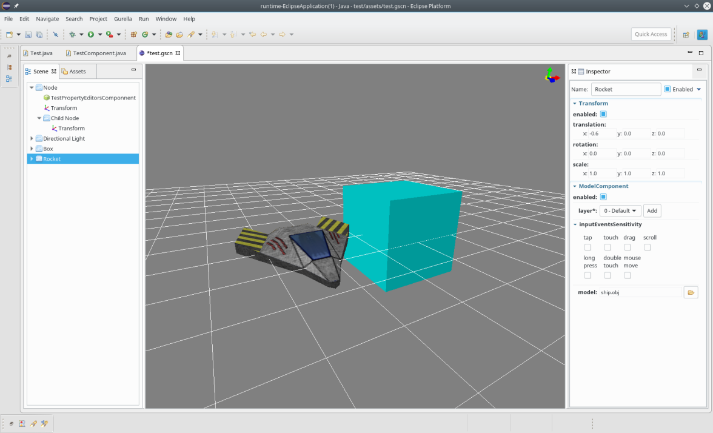
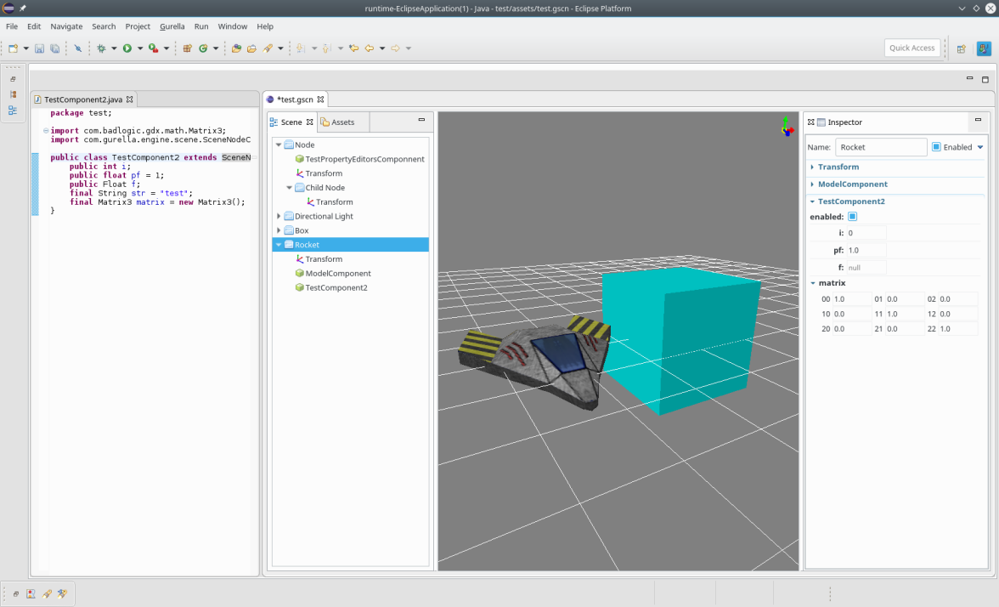
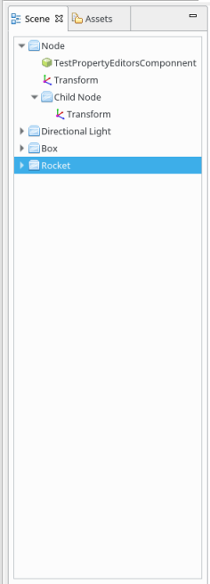
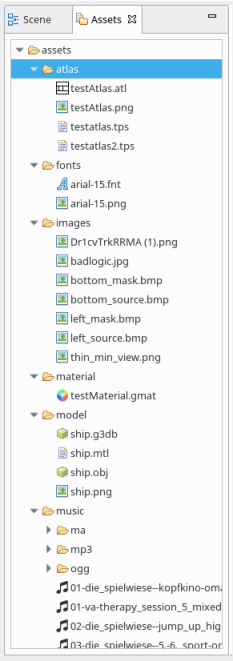
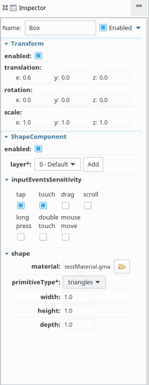
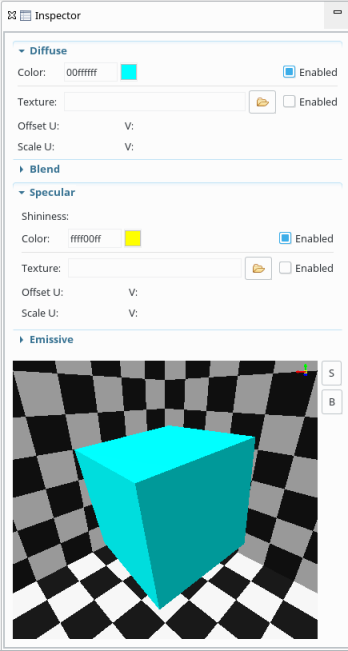

# gurella
Wrapper around libGDX and solid basis for merging its addons and contributions under one umbrella (gdx umbrella -> gurella). It features editor (Eclipse plugin) based around scene graph and entity/component system. This project is at a very early stage in development.

##Current features:
 * sprites
 * 3d models
 * skybox
 * lights (directional, point, spot)
 * cameras (ortographic and perspective)
 * bullet rigid body
 * spatial audio source and listener
 * prefabs (create entity and instantiate it)
 * custom components (add custom component by extending SceneNodeComponent class, attach it to scene node and edit its properties in inspector)
 * ...
 
##Screenshots:

Editor:

Create new component and edit its properties in inspector:

Sene graph view | Assets view | Inspector view | Material inspector
--- | --- | --- | ---
 |  |  | 
 
